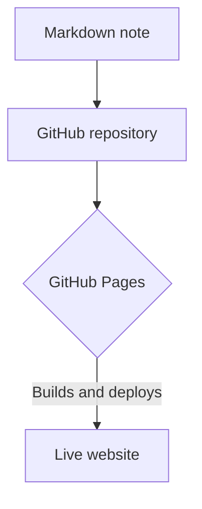

# From Markdown to a Live Website

One of the simplest ways to publish content online is to write it in Markdown, store it in a GitHub repository, and let GitHub Pages handle the rest. It’s a clean workflow for notes, documentation, and lightweight personal sites.

## How the process works

The idea is straightforward: write content, commit it, and publish it with a single build step. This approach keeps everything versioned and easy to manage.

## Why this setup is useful

- Simple publishing workflow
- Easy to track changes in Git
- Great for documentation and notes
- No complex backend required

For small projects or personal websites, this is often the fastest path from idea to published page.

Technical details

GitHub Pages takes the content from the repository and builds a static site, making it accessible as a live website. This is especially useful when the content is mostly text, images, and lightweight front-end assets.

It works particularly well for:
- personal blogs
- project documentation
- learning notes
- portfolio pages

